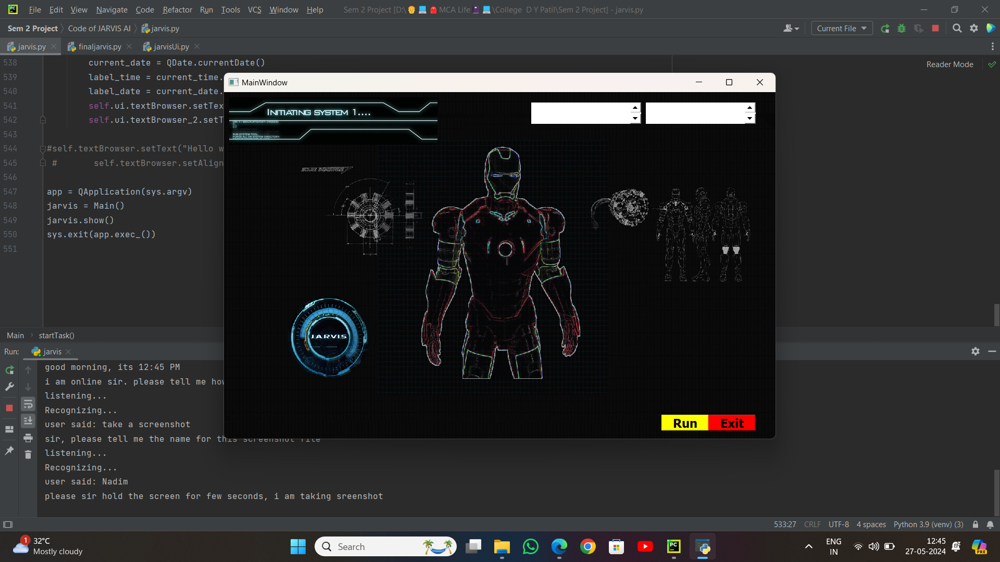
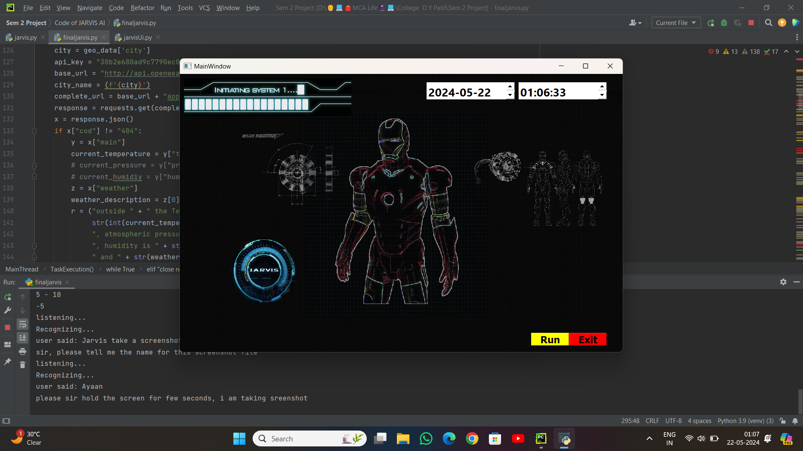

# Voice Assistant (JARVIS)


**📄 Project Overview**
Voice Assistant (JARVIS) is a Python-based virtual assistant that automates tasks through voice commands. It can perform various tasks, such as sending emails, playing music, reading PDFs, retrieving weather updates, setting reminders, and more. This project demonstrates the power of AI and natural language processing to simplify everyday tasks.

## **🚀 Features**

-**Email**: Send emails using voice commands.

-**PDF Reader**: Read out the contents of PDF files.

-**WhatsApp Messaging**: Send messages to contacts on WhatsApp.

-**Music Player**: Play music by voice command.

-**Web Search**: Search the internet for information.

-**Weather Updates**: Retrieve current weather information.

-**Reminders**: Set reminders for tasks and appointments.

-**Basic Conversations**: Engage in simple interactions and jokes.

## **💡 Technologies Used**

-**Programming Language**: Python 🐍

-**Libraries**:
-**pyttsx3**: Text-to-speech conversion

-**SpeechRecognition**: Capturing and interpreting voice commands

-**Wikipedia**: Fetching information from Wikipedia

-**smtplib**: Sending emails

-**pywhatkit**: Handling WhatsApp messages and web searches

-**pyjokes**: Telling jokes

-**pyPDF2**: Reading PDF files

-**pyautogui**: Automation tasks

-**pyQt5**: User interface for interaction


-**IDE**: PyCharm

## **📂 Project Structure**
-**jarvis.py**: Main script to run the voice assistant.

-**modules/**: Contains helper modules for specific functionalities.

-**requirements.txt**: List of required Python libraries.

## **🙏 Credits**
This project is inspired by various online tutorials and tech resources. Special thanks to the open-source community for providing the libraries that made this project possible.

## **⚖️ License**
This project is licensed under the MIT License.

## **🤝 Contributing**
Contributions are welcome! Feel free to fork the repository, make changes, and submit a pull request.

## **🐛 Issues**
If you encounter any issues or have suggestions for improvement, please open an issue on the GitHub repository.

## **📸 Project Images**
### Here are some screenshots of the Voice Assistant (JARVIS) in action:







## **🖥️ To Use and Update this Project**
 Clone the repository:
   ```bash
   https://github.com/nadeemahamad007/Voice-Assistant---JARVIS
